<div align="center">



### `godleads1@github:~$ build --secure --useful --measurable`

**Technology Founder · Project Leader · Python Backend & AI Engineering Learner**

I turn complex operational problems into secure, practical digital products—connecting business strategy, project delivery, data infrastructure, backend engineering and applied AI.

[LinkedIn](https://www.linkedin.com/in/egbuchulamchinedu/) · [VSURED](https://vsured.com/) · [Email](mailto:egbuchulamchinedu9@gmail.com)

</div>

---

### `./current-mission`

- Building secure, trustworthy systems across **enterprise AI, fintech and access technology**
- Learning and applying **Python backend engineering** and **AI engineering**
- Working with **FastAPI, PostgreSQL, pgvector, Alembic, Git/GitHub and automated testing**
- Growing from project leadership into a hands-on **technical founder-operator**
- Focused on evidence: working software, tests, secure configuration and measurable outcomes

### `./venture-map --status=building`

| Initiative | Mission | My focus |
|---|---|---|
| **Dataplegma** | Secure enterprise data infrastructure and proactive intelligence | Data strategy · autonomous AI · trusted systems |
| **VSURED** | Visitor management and AI-assisted customer support | Product leadership · backend delivery · security |
| **Xspeeria** | Cross-border financial infrastructure, starting with Nigeria–UK | Strategy · product · partnerships · governance |
| **KingdomCare** | Secure multi-church community-management platform | Platform vision · multi-tenant design · delivery |

> These initiatives are at different stages of development. I document what is built, what is being tested and what remains planned.

### `./toolbox --mode=learning-by-building`

```text
Backend       Python · FastAPI · REST APIs · SQLAlchemy · Alembic
Data          PostgreSQL · pgvector · MySQL · data pipelines
AI            RAG · embeddings · knowledge retrieval · AI agents
Delivery      Git · GitHub Actions · pytest · staging workflows
Cloud         AWS fundamentals · secure deployment patterns
Leadership    Product strategy · project delivery · governance · partnerships
```

### `./engineering-principles`

```python
principles = {
    "security": "designed in, tested, and evidenced",
    "delivery": "small milestones with clear acceptance criteria",
    "data": "trusted, governed, and controlled by its owner",
    "ai": "grounded, auditable, and connected to real outcomes",
    "growth": "learn deeply, build honestly, improve continuously",
}
```

### `./contributions --source=github`



<sub>Generated inside this repository from GitHub's public contribution calendar. No personal access token or third-party statistics service is used.</sub>

---

<div align="center">

**Open to conversations about backend engineering, applied AI, fintech infrastructure, secure digital products and technical project delivery.**

`Lagos, Nigeria · building systems that earn trust`

</div>
